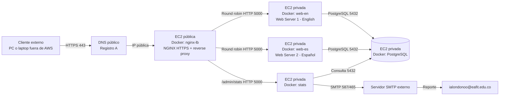

# 1. Introducción y Arquitectura

## 1. Objetivo del proyecto

Desplegar una aplicación web segura en la nube de Amazon AWS que permita registrar usuarios interesados en estudiar una carrera universitaria, almacenar la información en una base de datos PostgreSQL, balancear el tráfico entre dos servidores web mediante NGINX con política round-robin y generar estadísticas con gráficas enviadas por correo electrónico a `ialondonoo@eafit.edu.co`.

---

## 2. Descripción del problema

El proyecto exige implementar una infraestructura cloud completa con acceso público por HTTPS, dominio y DNS, balanceador de carga, dos servidores web (uno en inglés y otro en español), base de datos, Docker y documentación técnica. La aplicación debe registrar nombre, comuna, fecha de ingreso y carrera de interés entre Medicina, Ingeniería, Abogacía y Licenciatura. También debe demostrar balanceo round-robin entre dos servidores y generar estadísticas acumuladas con gráficas.

---

## 3. Requisitos del enunciado

### 3.1 Componentes obligatorios

| # | Componente | Descripción |
|---|---|---|
| 1 | Cliente externo | Navegador comercial en un computador fuera de AWS |
| 2 | Dominio público | Registro DNS tipo A hacia la IP pública del balanceador |
| 3 | HTTPS | Certificado de sitio (Let's Encrypt o autofirmado para laboratorio) |
| 4 | Balanceador de carga | NGINX como proxy inverso con política round-robin |
| 5 | Web Server 1 | Aplicación Flask en Docker, desplegada en **inglés** |
| 6 | Web Server 2 | Aplicación Flask en Docker, desplegada en **español** |
| 7 | Base de datos | PostgreSQL en Docker con volumen persistente |
| 8 | Aplicación de estadísticas | Dashboard con gráficas (Matplotlib + Chart.js) y envío SMTP |
| 9 | Docker | Todos los servicios corren en contenedores Docker |
| 10 | Despliegue en AWS | Instancia(s) EC2 con VPC, subredes y Security Groups |

### 3.2 Restricciones técnicas

- El cliente **no** se despliega en AWS; accede desde Internet.
- La base de datos **no** se expone a Internet; solo acepta conexiones internas.
- Los servidores web solo reciben tráfico desde el balanceador NGINX.
- Docker es obligatorio para todos los servicios.
- El direccionamiento debe coincidir con la VPC/subred real configurada en AWS.

### 3.3 Entregables

- Repositorio GitHub con código fuente completo.
- Aplicación funcionando en AWS con URL pública HTTPS.
- Informe final en PDF.
- Capturas de configuración y pruebas.

---

## 4. Arquitectura del sistema

### 4.1 Diagrama de arquitectura

```
Cliente externo (PC/Laptop fuera de AWS)
     │
     │ HTTPS puerto 443 / HTTP puerto 80
     ▼
DNS público (registro A) ──► Elastic IP del balanceador
     │
     ▼
┌─────────────────────────────────────────────────┐
│  EC2 Pública — Subred 10.0.1.0/24              │
│  ┌─────────────────────────────────┐            │
│  │  Docker: nginx-lb               │            │
│  │  NGINX: HTTPS + Proxy Inverso   │            │
│  │  Round Robin + Redirección      │            │
│  └──────────┬──────────────────────┘            │
└─────────────┼───────────────────────────────────┘
              │ HTTP interno puerto 5000
    ┌─────────┼─────────┐
    ▼                   ▼
┌──────────────┐  ┌──────────────┐
│ EC2 Privada  │  │ EC2 Privada  │
│ 10.0.2.11    │  │ 10.0.2.12    │
│ Docker:      │  │ Docker:      │
│ web-en       │  │ web-es       │
│ Flask inglés │  │ Flask español│
└──────┬───────┘  └──────┬───────┘
       │                 │
       └────────┬────────┘
                ▼
        ┌──────────────┐
        │ EC2 Privada  │
        │ 10.0.2.20    │
        │ Docker: db   │
        │ PostgreSQL   │
        └──────────────┘
                ▲
                │ Consulta SQL puerto 5432
        ┌──────────────┐
        │ EC2 Privada  │
        │ 10.0.2.30    │
        │ Docker: stats│
        │ Estadísticas │
        │ + SMTP       │
        └──────────────┘
```

### 4.2 Diagrama Mermaid



### 4.3 Flujo de una solicitud

1. El usuario abre `https://www.[dominio]` desde su computador externo (fuera de AWS).
2. El servidor DNS resuelve el dominio hacia la IP pública (Elastic IP) del balanceador.
3. NGINX recibe la conexión HTTPS en el puerto `443`.
4. NGINX valida el certificado SSL/TLS y actúa como proxy inverso.
5. NGINX reparte las solicitudes entre `web-en` y `web-es` con política **round-robin** (por defecto).
6. El servidor web que recibe la solicitud renderiza el formulario de registro.
7. Al enviar el formulario, la aplicación Flask inserta los datos en PostgreSQL (nombre, comuna, fecha de ingreso, carrera, idioma, servidor que atendió e IP del cliente).
8. El usuario recibe confirmación del registro exitoso con el ID asignado.
9. El administrador puede acceder a `/admin/stats` para ver las estadísticas acumuladas y enviar el reporte por correo.

---

## 5. Tabla de direccionamiento de red

### 5.1 VPC y subredes

| Recurso | CIDR | Máscara | Tipo |
|---|---|---|---|
| VPC | `10.0.0.0/16` | `255.255.0.0` | Red completa |
| Subred pública | `10.0.1.0/24` | `255.255.255.0` | Balanceador NGINX |
| Subred privada | `10.0.2.0/24` | `255.255.255.0` | Webs, Stats, BD |

### 5.2 Asignación de IPs por componente

| Componente | Tipo | IP privada | IP pública | Subred | Gateway | Puertos |
|---|---|---|---|---|---|---|
| Cliente externo | Cliente | N/A | IP del ISP | Internet | ISP | 443/80 salida |
| NGINX LB | Balanceador | `10.0.1.10` | Elastic IP | `10.0.1.0/24` | `10.0.1.1` | 80, 443 entrada |
| Web Server 1 (inglés) | Web | `10.0.2.11` | Ninguna | `10.0.2.0/24` | `10.0.2.1` | 5000 desde LB |
| Web Server 2 (español) | Web | `10.0.2.12` | Ninguna | `10.0.2.0/24` | `10.0.2.1` | 5000 desde LB |
| Stats | Estadísticas | `10.0.2.30` | Ninguna | `10.0.2.0/24` | `10.0.2.1` | 5000 desde LB, SMTP salida |
| PostgreSQL | Base de datos | `10.0.2.20` | Ninguna | `10.0.2.0/24` | `10.0.2.1` | 5432 interno |

> Las direcciones son una propuesta de ejemplo. En la entrega final se reemplazan por las IPs reales asignadas por AWS.

### 5.3 Tablas de rutas

**Subred pública `10.0.1.0/24`:**

| Destino | Target |
|---|---|
| `10.0.0.0/16` | local |
| `0.0.0.0/0` | Internet Gateway |

**Subred privada `10.0.2.0/24`:**

| Destino | Target |
|---|---|
| `10.0.0.0/16` | local |
| `0.0.0.0/0` | NAT Gateway (opcional, para actualizaciones) |

### 5.4 Security Groups

**`sg-lb` — Balanceador NGINX:**

| Dirección | Protocolo | Puerto | Origen/Destino |
|---|---|---|---|
| Entrada | TCP | 80 | `0.0.0.0/0` |
| Entrada | TCP | 443 | `0.0.0.0/0` |
| Entrada | TCP | 22 | IP de los integrantes |
| Salida | TCP | 5000 | `sg-web`, `sg-stats` |

**`sg-web` — Servidores web:**

| Dirección | Protocolo | Puerto | Origen/Destino |
|---|---|---|---|
| Entrada | TCP | 5000 | `sg-lb` |
| Salida | TCP | 5432 | `sg-db` |

**`sg-stats` — Estadísticas:**

| Dirección | Protocolo | Puerto | Origen/Destino |
|---|---|---|---|
| Entrada | TCP | 5000 | `sg-lb` |
| Salida | TCP | 5432 | `sg-db` |
| Salida | TCP | 587/465 | Servidor SMTP |

**`sg-db` — Base de datos:**

| Dirección | Protocolo | Puerto | Origen/Destino |
|---|---|---|---|
| Entrada | TCP | 5432 | `sg-web`, `sg-stats` |
| Salida | — | — | Respuestas establecidas (stateful) |

### 5.5 Puertos Docker (docker-compose.yml)

| Servicio | Puerto contenedor | Puerto host | Exposición |
|---|---|---|---|
| `nginx-lb` | 80, 443 | 80, 443 | Pública (`ports`) |
| `web-en` | 5000 | Ninguno | Solo red Docker interna (`expose`) |
| `web-es` | 5000 | Ninguno | Solo red Docker interna (`expose`) |
| `stats` | 5000 | Ninguno | Solo por NGINX (`expose`) |
| `db` | 5432 | Ninguno | Solo red Docker interna |
