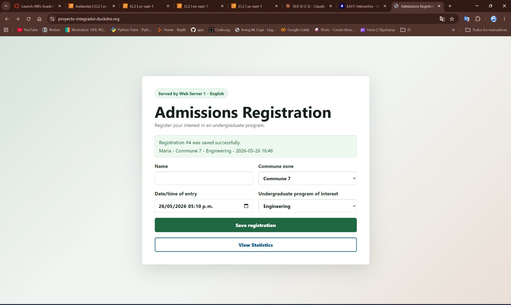
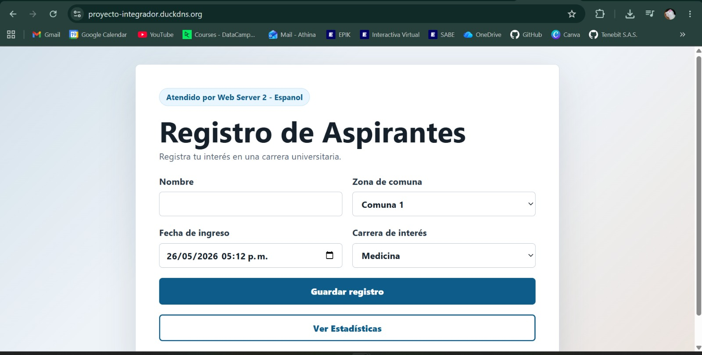
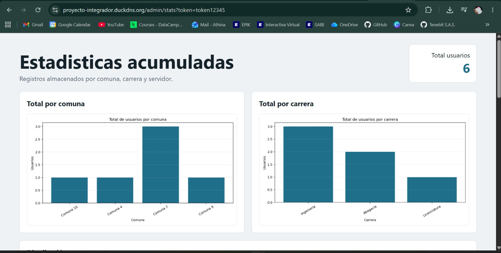
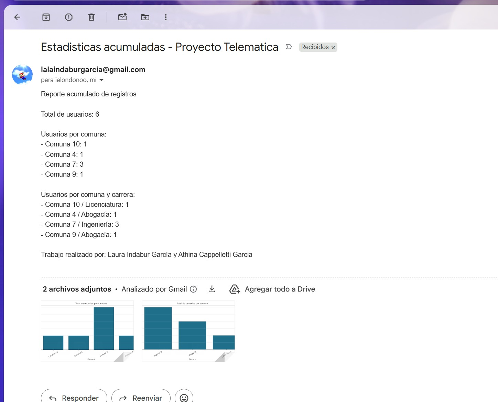
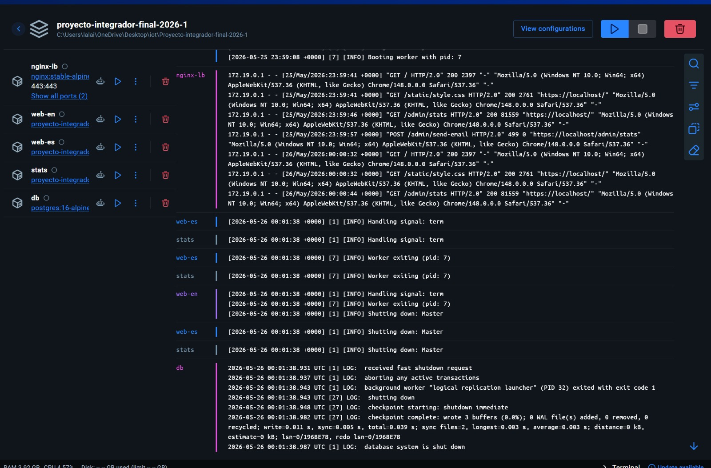

## 8. Scripts de automatización

### 8.1 `scripts/deploy.sh` (Linux/macOS)

Script de despliegue automatizado que:
1. Copia `.env.example` a `.env` si no existe.
2. Carga las variables de entorno.
3. Genera un certificado autofirmado si no hay certificados en `nginx/certs/`.
4. Ejecuta `docker compose up -d --build`.
5. Muestra el estado de los contenedores.

### 8.2 `scripts/deploy.ps1` (Windows PowerShell)

Equivalente del script de despliegue para Windows que:
1. Verifica y crea `.env` si no existe.
2. Genera certificados usando `openssl` si está disponible, o alternativamente con la API de .NET si openssl no está instalado.
3. Verifica que Docker Desktop esté corriendo antes de continuar.
4. Ejecuta `docker compose up -d --build`.

### 8.3 `scripts/test.sh`

Script de pruebas automatizadas que verifica:
1. Configuración de Docker Compose válida.
2. Contenedores corriendo.
3. Resolución DNS (si el dominio no es localhost).
4. Conectividad HTTPS.
5. Balanceo round-robin (6 solicitudes consecutivas verificando alternancia de servidores).
6. Endpoint de estadísticas accesible.

### 8.4 `scripts/backup-db.sh`

Script de respaldo que ejecuta `pg_dump` dentro del contenedor de PostgreSQL y guarda el archivo SQL con timestamp en `backups/`.

---

## 9. Pruebas realizadas

### 9.1 Prueba de DNS

**Comando:**
```bash
nslookup www.[dominio]
```

**Resultado esperado:** El dominio resuelve a la IP pública del balanceador.

### 9.2 Prueba de HTTPS

**Comando:**
```bash
curl -Iv https://www.[dominio]
```

**Resultado esperado:** Conexión exitosa HTTPS, certificado válido (o advertencia si es autofirmado).

### 9.3 Prueba de balanceo round-robin

**Comando:**
```bash
curl -k https://www.[dominio]
curl -k https://www.[dominio]
curl -k https://www.[dominio]
curl -k https://www.[dominio]
```

**Resultado esperado:** Alternancia visible entre:
- `Served by Web Server 1 - English`
- `Atendido por Web Server 2 - Espanol`

### 9.4 Prueba de registro de usuario

**Pasos:**
1. Abrir la URL pública en un navegador.
2. Llenar el formulario con nombre, comuna, fecha y carrera.
3. Clic en "Save registration" / "Guardar registro".
4. Repetir desde ambos servidores.

**Resultado esperado:** Mensaje de confirmación con el ID del registro asignado.

### 9.5 Prueba de base de datos

**Comando:**
```bash
docker compose exec db psql -U telematica_user -d telematica \
  -c "SELECT id, name, commune, program, language, entry_at, served_by FROM registrations ORDER BY id DESC;"
```

**Resultado esperado:** Se ven los registros enviados desde ambos formularios con el idioma y servidor correspondiente.

### 9.6 Prueba de estadísticas

**URL:**
```
https://www.[dominio]/admin/stats
```

**Resultado esperado:** Dashboard mostrando total de usuarios, gráficas por comuna, por carrera, tabla cruzada por comuna/carrera, y últimos registros.

### 9.7 Prueba de correo SMTP

**Acción:** Clic en "Enviar estadísticas por correo" desde el dashboard.

**Resultado esperado:** Mensaje de envío exitoso y correo recibido en `ialondonoo@eafit.edu.co` con las gráficas adjuntas.

### 9.8 Prueba de simultaneidad

**Comando:**
```bash
for i in $(seq 1 20); do curl -k -s https://www.[dominio] >/dev/null & done; wait
```

**Resultado esperado:** NGINX responde sin errores, no se pierden registros, los logs muestran tráfico distribuido hacia ambos servidores.

### 9.9 Script de pruebas automatizado

```bash
./scripts/test.sh https://www.[dominio]
```

---

## 10. Capturas de pantalla

> **Instrucciones:** Agregar aquí las capturas de pantalla del sistema funcionando. Guardar las imágenes en la carpeta `docs/capturas/` y referenciarlas a continuación.


### 10.4 Formulario Web Server 1 — Inglés

<!-- Insertar captura del formulario en inglés con el badge "Served by Web Server 1 - English" -->



### 10.5 Formulario Web Server 2 — Español

<!-- Insertar captura del formulario en español con el badge "Atendido por Web Server 2 - Espanol" -->



### 10.6 Registro exitoso

<!-- Insertar captura del mensaje de confirmación del registro -->


### 10.9 Dashboard de estadísticas

<!-- Insertar captura del panel de estadísticas con gráficas -->



### 10.10 Correo enviado

<!-- Insertar captura del correo recibido en ialondonoo@eafit.edu.co -->



### 10.11 Contenedores corriendo

<!-- Insertar captura de docker compose ps mostrando todos los contenedores -->



---

## 11. Problemas encontrados y soluciones

| # | Problema | Causa | Solución |
|---|---|---|---|
| 1 | El navegador muestra advertencia HTTPS | Certificado autofirmado | Emitir certificado con Let's Encrypt para el dominio real |
| 2 | DNS no resuelve | Registro A incorrecto o propagación pendiente | Verificar IP pública correcta y esperar propagación DNS |
| 3 | No alterna round-robin | Cache del navegador, una app caída o upstream mal configurado | Revisar `docker compose ps` y logs de NGINX; usar `curl -k` para evitar cache |
| 4 | DB rechaza conexión | Variables `.env` o Security Group incorrectos | Validar `DB_HOST`, usuario, password y que el puerto 5432 sea accesible internamente |
| 5 | Correo no sale | SMTP sin credenciales o puerto bloqueado por AWS | Configurar variables `SMTP_*`, generar app password de Gmail y permitir salida TCP 587/465 |
| 6 | Contenedores no inician | Docker no está corriendo o imagen no se construyó | Abrir Docker Desktop, verificar con `docker info`, ejecutar `docker compose up -d --build` |
| 7 | Flask no conecta a PostgreSQL | El contenedor `db` no ha terminado de inicializar | El `healthcheck` y `depends_on: condition: service_healthy` en Docker Compose aseguran que Flask espere a que PostgreSQL esté listo |

---

## 12. Conclusiones

El proyecto integra conceptos fundamentales de telemática, redes, protocolos, contenedores y computación en la nube. La solución implementada demuestra:

- **Acceso seguro por HTTPS** con terminación SSL/TLS en el balanceador NGINX.
- **DNS público** resolviendo hacia la IP pública del balanceador.
- **Balanceo de carga round-robin** con NGINX distribuyendo tráfico entre dos servidores web.
- **Aplicaciones web bilingües** (inglés y español) desarrolladas en Python Flask, cada una en su propio contenedor Docker.
- **Persistencia de datos** en PostgreSQL con volumen Docker persistente.
- **Generación de estadísticas** con gráficas (Matplotlib + Chart.js) y tablas de datos cruzados.
- **Envío de reportes por correo** SMTP con gráficas adjuntas al profesor.
- **Contenerización completa** con Docker y Docker Compose, permitiendo despliegue reproducible.
- **Separación de capas** entre cliente externo, capa pública (balanceador) y servicios internos (webs, stats, BD), siguiendo buenas prácticas de seguridad de red.

La arquitectura permite un despliegue económico en una sola EC2 para laboratorio, y un despliegue distribuido en múltiples EC2 para una sustentación estricta con instancias separadas.

---

## 13. Anexos

### 13.1 Comandos de referencia rápida

```bash
# Configuración inicial
cp .env.example .env
nano .env                              # Editar variables

# Despliegue
./scripts/deploy.sh                    # Linux/macOS
.\scripts\deploy.ps1                   # Windows

# Estado y logs
docker compose ps
docker compose logs -f nginx-lb
docker compose logs -f web-en
docker compose logs -f web-es
docker compose logs -f stats
docker compose logs -f db

# Pruebas
curl -k https://www.[dominio]
curl -k https://www.[dominio]/admin/stats
./scripts/test.sh https://www.[dominio]

# Backup de base de datos
./scripts/backup-db.sh

# Detener servicios
docker compose down
```

### 13.2 Estructura completa del repositorio

```
Proyecto-integrador-final-2026-1/
├── .env.example               # Variables de entorno de ejemplo
├── .gitignore                 # Archivos ignorados por Git
├── README.md                  # Instrucciones de ejecución rápida
├── docker-compose.yml         # Definición de servicios Docker
│
├── nginx/                     # Configuración del balanceador
│   ├── nginx.conf             # Configuración completa de NGINX
│   └── certs/                 # Certificados SSL (no versionados)
│
├── web-en/                    # Web Server 1 — Inglés
│   ├── Dockerfile
│   ├── app.py
│   ├── requirements.txt
│   ├── static/style.css
│   └── templates/index.html
│
├── web-es/                    # Web Server 2 — Español
│   ├── Dockerfile
│   ├── app.py
│   ├── requirements.txt
│   ├── static/style.css
│   └── templates/index.html
│
├── stats/                     # Aplicación de estadísticas
│   ├── Dockerfile
│   ├── app.py
│   ├── requirements.txt
│   └── templates/stats.html
│
├── db/                        # Base de datos
│   └── init.sql               # Script de inicialización
│
├── scripts/                   # Scripts de automatización
│   ├── deploy.sh              # Despliegue (Linux/macOS)
│   ├── deploy.ps1             # Despliegue (Windows)
│   ├── test.sh                # Pruebas automatizadas
│   └── backup-db.sh           # Backup de PostgreSQL
│
└── docs/                      # Documentación
    ├── informe-final.md       # Este informe
    └── capturas/              # Capturas de pantalla
```

### 13.3 Fuentes consultadas

- AWS VPC Internet Gateway: https://docs.aws.amazon.com/vpc/latest/userguide/VPC_Internet_Gateway.html
- Certbot NGINX/Linux: https://certbot.eff.org/instructions?ws=nginx&os=linux
- DuckDNS: https://www.duckdns.org/
- No-IP Free Dynamic DNS: https://www.noip.com/free
- FreeDNS afraid.org: https://freedns.afraid.org/
- Flask Documentation: https://flask.palletsprojects.com/
- NGINX Documentation: https://nginx.org/en/docs/
- Docker Compose Documentation: https://docs.docker.com/compose/
- PostgreSQL Documentation: https://www.postgresql.org/docs/16/
- Matplotlib Documentation: https://matplotlib.org/stable/
- Chart.js Documentation: https://www.chartjs.org/docs/
