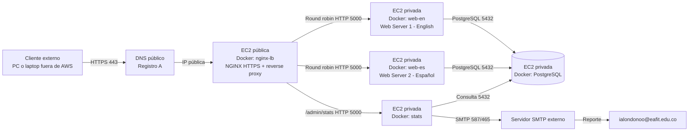

# Informe Final — Proyecto Integrador de Telemática

## Portada

**Proyecto:** Despliegue de servicio telemático seguro en AWS  
**Materia:** Internet: Arquitectura y Protocolos / Telemática  
**Institución:** Universidad EAFIT  
**Integrantes:** Laura Indabur García y Athina Cappelletti Garcia   
**Fecha:** Mayo 2026  
**Repositorio GitHub:** [https://github.com/Athina7-7/Proyecto-integrador-final-2026-1]  


---

# 1. Introducción y Arquitectura

## 1. Objetivo del proyecto

Desplegar una aplicación web segura en la nube de Amazon AWS que permita registrar usuarios interesados en estudiar una carrera universitaria, almacenar la información en una base de datos PostgreSQL, balancear el tráfico entre dos servidores web mediante NGINX con política round-robin y generar estadísticas con gráficas enviadas por correo electrónico a `ialondonoo@eafit.edu.co`.

---

## 2. Descripción del problema

El proyecto exige implementar una infraestructura cloud completa con acceso público por HTTPS, dominio y DNS, balanceador de carga, dos servidores web (uno en inglés y otro en español), base de datos, Docker y documentación técnica. La aplicación debe registrar nombre, comuna, fecha de ingreso y carrera de interés entre Medicina, Ingeniería, Abogacía y Licenciatura. También debe demostrar balanceo round-robin entre dos servidores y generar estadísticas acumuladas con gráficas.

---

## 3. Requisitos del enunciado

### 3.1 Componentes obligatorios

| # | Componente | Descripción |
|---|---|---|
| 1 | Cliente externo | Navegador comercial en un computador fuera de AWS |
| 2 | Dominio público | Registro DNS tipo A hacia la IP pública del balanceador |
| 3 | HTTPS | Certificado de sitio (Let's Encrypt o autofirmado para laboratorio) |
| 4 | Balanceador de carga | NGINX como proxy inverso con política round-robin |
| 5 | Web Server 1 | Aplicación Flask en Docker, desplegada en **inglés** |
| 6 | Web Server 2 | Aplicación Flask en Docker, desplegada en **español** |
| 7 | Base de datos | PostgreSQL en Docker con volumen persistente |
| 8 | Aplicación de estadísticas | Dashboard con gráficas (Matplotlib + Chart.js) y envío SMTP |
| 9 | Docker | Todos los servicios corren en contenedores Docker |
| 10 | Despliegue en AWS | Instancia(s) EC2 con VPC, subredes y Security Groups |

### 3.2 Restricciones técnicas

- El cliente **no** se despliega en AWS; accede desde Internet.
- La base de datos **no** se expone a Internet; solo acepta conexiones internas.
- Los servidores web solo reciben tráfico desde el balanceador NGINX.
- Docker es obligatorio para todos los servicios.
- El direccionamiento debe coincidir con la VPC/subred real configurada en AWS.

### 3.3 Entregables

- Repositorio GitHub con código fuente completo.
- Aplicación funcionando en AWS con URL pública HTTPS.
- Informe final en PDF.
- Capturas de configuración y pruebas.

---

## 4. Arquitectura del sistema

### 4.1 Diagrama de arquitectura

```
Cliente externo (PC/Laptop fuera de AWS)
     │
     │ HTTPS puerto 443 / HTTP puerto 80
     ▼
DNS público (registro A) ──► Elastic IP del balanceador
     │
     ▼
┌─────────────────────────────────────────────────┐
│  EC2 Pública — Subred 10.0.1.0/24              │
│  ┌─────────────────────────────────┐            │
│  │  Docker: nginx-lb               │            │
│  │  NGINX: HTTPS + Proxy Inverso   │            │
│  │  Round Robin + Redirección      │            │
│  └──────────┬──────────────────────┘            │
└─────────────┼───────────────────────────────────┘
              │ HTTP interno puerto 5000
    ┌─────────┼─────────┐
    ▼                   ▼
┌──────────────┐  ┌──────────────┐
│ EC2 Privada  │  │ EC2 Privada  │
│ 10.0.2.11    │  │ 10.0.2.12    │
│ Docker:      │  │ Docker:      │
│ web-en       │  │ web-es       │
│ Flask inglés │  │ Flask español│
└──────┬───────┘  └──────┬───────┘
       │                 │
       └────────┬────────┘
                ▼
        ┌──────────────┐
        │ EC2 Privada  │
        │ 10.0.2.20    │
        │ Docker: db   │
        │ PostgreSQL   │
        └──────────────┘
                ▲
                │ Consulta SQL puerto 5432
        ┌──────────────┐
        │ EC2 Privada  │
        │ 10.0.2.30    │
        │ Docker: stats│
        │ Estadísticas │
        │ + SMTP       │
        └──────────────┘
```

### 4.2 Diagrama Mermaid



### 4.3 Flujo de una solicitud

1. El usuario abre `https://www.[dominio]` desde su computador externo (fuera de AWS).
2. El servidor DNS resuelve el dominio hacia la IP pública (Elastic IP) del balanceador.
3. NGINX recibe la conexión HTTPS en el puerto `443`.
4. NGINX valida el certificado SSL/TLS y actúa como proxy inverso.
5. NGINX reparte las solicitudes entre `web-en` y `web-es` con política **round-robin** (por defecto).
6. El servidor web que recibe la solicitud renderiza el formulario de registro.
7. Al enviar el formulario, la aplicación Flask inserta los datos en PostgreSQL (nombre, comuna, fecha de ingreso, carrera, idioma, servidor que atendió e IP del cliente).
8. El usuario recibe confirmación del registro exitoso con el ID asignado.
9. El administrador puede acceder a `/admin/stats` para ver las estadísticas acumuladas y enviar el reporte por correo.

---

## 5. Tabla de direccionamiento de red

### 5.1 VPC y subredes

| Recurso | CIDR | Máscara | Tipo |
|---|---|---|---|
| VPC | `10.0.0.0/16` | `255.255.0.0` | Red completa |
| Subred pública | `10.0.1.0/24` | `255.255.255.0` | Balanceador NGINX |
| Subred privada | `10.0.2.0/24` | `255.255.255.0` | Webs, Stats, BD |

### 5.2 Asignación de IPs por componente

| Componente | Tipo | IP privada | IP pública | Subred | Gateway | Puertos |
|---|---|---|---|---|---|---|
| Cliente externo | Cliente | N/A | IP del ISP | Internet | ISP | 443/80 salida |
| NGINX LB | Balanceador | `10.0.1.10` | Elastic IP | `10.0.1.0/24` | `10.0.1.1` | 80, 443 entrada |
| Web Server 1 (inglés) | Web | `10.0.2.11` | Ninguna | `10.0.2.0/24` | `10.0.2.1` | 5000 desde LB |
| Web Server 2 (español) | Web | `10.0.2.12` | Ninguna | `10.0.2.0/24` | `10.0.2.1` | 5000 desde LB |
| Stats | Estadísticas | `10.0.2.30` | Ninguna | `10.0.2.0/24` | `10.0.2.1` | 5000 desde LB, SMTP salida |
| PostgreSQL | Base de datos | `10.0.2.20` | Ninguna | `10.0.2.0/24` | `10.0.2.1` | 5432 interno |

> Las direcciones son una propuesta de ejemplo. En la entrega final se reemplazan por las IPs reales asignadas por AWS.

### 5.3 Tablas de rutas

**Subred pública `10.0.1.0/24`:**

| Destino | Target |
|---|---|
| `10.0.0.0/16` | local |
| `0.0.0.0/0` | Internet Gateway |

**Subred privada `10.0.2.0/24`:**

| Destino | Target |
|---|---|
| `10.0.0.0/16` | local |
| `0.0.0.0/0` | NAT Gateway (opcional, para actualizaciones) |

### 5.4 Security Groups

**`sg-lb` — Balanceador NGINX:**

| Dirección | Protocolo | Puerto | Origen/Destino |
|---|---|---|---|
| Entrada | TCP | 80 | `0.0.0.0/0` |
| Entrada | TCP | 443 | `0.0.0.0/0` |
| Entrada | TCP | 22 | IP de los integrantes |
| Salida | TCP | 5000 | `sg-web`, `sg-stats` |

**`sg-web` — Servidores web:**

| Dirección | Protocolo | Puerto | Origen/Destino |
|---|---|---|---|
| Entrada | TCP | 5000 | `sg-lb` |
| Salida | TCP | 5432 | `sg-db` |

**`sg-stats` — Estadísticas:**

| Dirección | Protocolo | Puerto | Origen/Destino |
|---|---|---|---|
| Entrada | TCP | 5000 | `sg-lb` |
| Salida | TCP | 5432 | `sg-db` |
| Salida | TCP | 587/465 | Servidor SMTP |

**`sg-db` — Base de datos:**

| Dirección | Protocolo | Puerto | Origen/Destino |
|---|---|---|---|
| Entrada | TCP | 5432 | `sg-web`, `sg-stats` |
| Salida | — | — | Respuestas establecidas (stateful) |

### 5.5 Puertos Docker (docker-compose.yml)

| Servicio | Puerto contenedor | Puerto host | Exposición |
|---|---|---|---|
| `nginx-lb` | 80, 443 | 80, 443 | Pública (`ports`) |
| `web-en` | 5000 | Ninguno | Solo red Docker interna (`expose`) |
| `web-es` | 5000 | Ninguno | Solo red Docker interna (`expose`) |
| `stats` | 5000 | Ninguno | Solo por NGINX (`expose`) |
| `db` | 5432 | Ninguno | Solo red Docker interna |

---

# 2. Configuración del despliegue

# 6. Documentación del proceso de configuración del despliegue

### 6.1 Configuración AWS

#### 6.1.1 Recursos creados

1. **VPC** — `10.0.0.0/16` en la región indicada por el profesor.
2. **Subred pública** — `10.0.1.0/24` con ruta a Internet Gateway.
3. **Subred privada** — `10.0.2.0/24` sin acceso directo a Internet.
4. **Internet Gateway** — conectado a la VPC, referenciado en la tabla de rutas pública.
5. **Elastic IP** — asociada a la instancia EC2 del balanceador.
6. **Route tables** — una pública (con `0.0.0.0/0 → IGW`) y una privada (con NAT Gateway opcional).

#### 6.1.2 Instancias EC2

| Instancia | AMI | Tipo | Subred | Security Group | Contenedor |
|---|---|---|---|---|---|
| Balanceador | Ubuntu Server LTS | `t2.micro` | Pública | `sg-lb` | `nginx-lb` |
| Web Server 1 | Ubuntu Server LTS | `t2.micro` | Privada | `sg-web` | `web-en` |
| Web Server 2 | Ubuntu Server LTS | `t2.micro` | Privada | `sg-web` | `web-es` |
| Base de datos | Ubuntu Server LTS | `t2.micro` | Privada | `sg-db` | `db` |
| Estadísticas | Ubuntu Server LTS | `t2.micro` | Privada | `sg-stats` | `stats` |

> **Modo laboratorio:** Se puede usar una sola EC2 pública con `docker compose up -d --build` para levantar todos los contenedores. Solo se exponen puertos 80 y 443 del balanceador; Flask/PostgreSQL quedan sin puertos publicados al host.

#### 6.1.3 Instalación de Docker en cada EC2 (Ubuntu)

```bash
# Actualizar paquetes
sudo apt update
sudo apt install -y ca-certificates curl gnupg openssl git

# Agregar clave GPG de Docker
sudo install -m 0755 -d /etc/apt/keyrings
curl -fsSL https://download.docker.com/linux/ubuntu/gpg | sudo gpg --dearmor -o /etc/apt/keyrings/docker.gpg
sudo chmod a+r /etc/apt/keyrings/docker.gpg

# Agregar repositorio Docker
echo \
  "deb [arch=$(dpkg --print-architecture) signed-by=/etc/apt/keyrings/docker.gpg] https://download.docker.com/linux/ubuntu \
  $(. /etc/os-release && echo "$VERSION_CODENAME") stable" | \
  sudo tee /etc/apt/sources.list.d/docker.list > /dev/null

# Instalar Docker Engine + Compose
sudo apt update
sudo apt install -y docker-ce docker-ce-cli containerd.io docker-buildx-plugin docker-compose-plugin

# Agregar usuario al grupo docker
sudo usermod -aG docker ubuntu
```

Cerrar y volver a abrir la sesión SSH para aplicar el grupo `docker`.

### 6.2 Configuración DNS

#### 6.2.1 Objetivo

Crear un nombre público que resuelva a la IP pública (Elastic IP) del balanceador NGINX.

```
www.[dominio] → Registro A → Elastic IP del balanceador
```

#### 6.2.2 Opciones de proveedor DNS (gratuitas/académicas)

| Proveedor | Tipo | URL |
|---|---|---|
| DuckDNS | Subdominio gratuito bajo `duckdns.org` | https://www.duckdns.org/ |
| No-IP | Hostname gratuito de entrada | https://www.noip.com/free |
| FreeDNS (afraid.org) | DNS y subdominios gratuitos | https://freedns.afraid.org/ |
| Dominio institucional | Según permiso del profesor | — |

#### 6.2.3 Registro DNS requerido

| Tipo | Nombre | Valor | TTL |
|---|---|---|---|
| A | `www` | IP pública del balanceador | 300 |
| A | `@` | IP pública del balanceador | 300 |

Ejemplo con DuckDNS:
```
proyecto-telematica.duckdns.org → Elastic IP del balanceador
```

#### 6.2.4 Comprobación DNS

```bash
nslookup www.[dominio]
ping www.[dominio]
curl -k https://www.[dominio]
```

Resultado esperado:
- `nslookup` devuelve la IP pública del balanceador.
- `ping` resuelve el nombre (puede fallar respuesta ICMP si AWS lo bloquea).
- `curl -k` carga el HTML de una de las dos aplicaciones web.

### 6.3 Certificado HTTPS

#### 6.3.1 Opción recomendada: Let's Encrypt con Certbot

**Instalación (Ubuntu):**

```bash
sudo snap install --classic certbot
sudo ln -s /snap/bin/certbot /usr/local/bin/certbot
```

**Generar certificado:**

```bash
# Detener NGINX temporalmente para usar modo standalone
docker compose stop nginx-lb

# Generar certificado
sudo certbot certonly --standalone -d www.[dominio] -d [dominio]

# Copiar certificados al directorio de Docker
sudo cp /etc/letsencrypt/live/www.[dominio]/fullchain.pem nginx/certs/fullchain.pem
sudo cp /etc/letsencrypt/live/www.[dominio]/privkey.pem nginx/certs/privkey.pem
sudo chown "$USER":"$USER" nginx/certs/fullchain.pem nginx/certs/privkey.pem

# Reiniciar NGINX
docker compose up -d nginx-lb
```

**Renovación:**

```bash
sudo certbot renew --dry-run
# Si se renueva, copiar nuevos .pem y recargar:
docker compose exec nginx-lb nginx -s reload
```

#### 6.3.2 Opción alternativa: certificado autofirmado (solo laboratorio)

```bash
openssl req -x509 -nodes -days 30 -newkey rsa:2048 \
  -keyout nginx/certs/privkey.pem \
  -out nginx/certs/fullchain.pem \
  -subj "/CN=localhost"
```

> **Nota:** El certificado autofirmado genera advertencia en el navegador porque la autoridad emisora no es de confianza. No se recomienda para la entrega final si el proyecto exige certificado público válido.

#### 6.3.3 Detalles del certificado utilizado

El proyecto implementa un certificado autofirmado con los siguientes detalles:

| Propiedad | Valor |
|-----------|-------|
| **Dominio** | localhost |
| **Tipo** | Certificado autofirmado (para laboratorio) |
| **Validez** | 21 de mayo 2026 - 20 de junio 2026 |
| **Algoritmo** | RSA 2048-bit |
| **Uso** | SSL/TLS para HTTPS |
| **Ubicación** | `nginx/certs/fullchain.pem` (público) y `nginx/certs/privkey.pem` (privado) |

#### 6.3.4 Configuración en NGINX

El certificado se configura en `nginx/nginx.conf` (líneas 48-49):

```nginx
server {
    listen 443 ssl;
    http2 on;
    server_name _;

    ssl_certificate /etc/nginx/certs/fullchain.pem;
    ssl_certificate_key /etc/nginx/certs/privkey.pem;
    ssl_protocols TLSv1.2 TLSv1.3;
    ssl_prefer_server_ciphers off;
}
```

**Explicación:**
- `listen 443 ssl`: Escucha conexiones HTTPS en puerto 443
- `http2 on`: Activa protocolo HTTP/2 para mejor rendimiento
- `ssl_certificate`: Certificado público (puede compartirse)
- `ssl_certificate_key`: Llave privada (CONFIDENCIAL, nunca compartir)
- `ssl_protocols TLSv1.2 TLSv1.3`: Solo protocolos HTTPS modernos

#### 6.3.5 Montaje en Docker

En `docker-compose.yml` (líneas 10-11), se monta el certificado:

```yaml
volumes:
  - ./nginx/nginx.conf:/etc/nginx/nginx.conf:ro
  - ./nginx/certs:/etc/nginx/certs:ro
```

El sufijo `:ro` (read-only) significa que el contenedor puede leer pero no modificar estos archivos.

#### 6.3.6 Para producción en AWS con Let's Encrypt

En despliegue real en AWS, se debe usar **Let's Encrypt** (certificado público válido y gratuito):

```bash
# Instalar Certbot
sudo snap install --classic certbot

# Generar certificado válido
sudo certbot certonly --standalone -d midominio.com -d www.midominio.com

# Copiar certificados
sudo cp /etc/letsencrypt/live/midominio.com/fullchain.pem ./nginx/certs/
sudo cp /etc/letsencrypt/live/midominio.com/privkey.pem ./nginx/certs/

# Recargar NGINX
docker compose exec nginx-lb nginx -s reload
```

La renovación automática se hace con:

```bash
sudo certbot renew
```

### 6.4 Configuración Docker y Docker Compose

#### 6.4.1 Archivo `docker-compose.yml`

El archivo define 5 servicios, 2 redes y 1 volumen persistente:

```yaml
services:
  nginx-lb:           # Balanceador NGINX con HTTPS
    image: nginx:stable-alpine
    ports: ["80:80", "443:443"]
    volumes:
      - ./nginx/nginx.conf:/etc/nginx/nginx.conf:ro
      - ./nginx/certs:/etc/nginx/certs:ro
    depends_on: [web-en, web-es, stats]
    networks: [public, backend]

  web-en:             # Web Server 1 — Inglés
    build: ./web-en
    env_file: .env
    environment:
      DB_HOST: db
      SERVED_BY: Served by Web Server 1 - English
      APP_LANGUAGE: English
    expose: ["5000"]
    depends_on:
      db: { condition: service_healthy }
    networks: [backend]

  web-es:             # Web Server 2 — Español
    build: ./web-es
    env_file: .env
    environment:
      DB_HOST: db
      SERVED_BY: Atendido por Web Server 2 - Espanol
      APP_LANGUAGE: Espanol
    expose: ["5000"]
    depends_on:
      db: { condition: service_healthy }
    networks: [backend]

  stats:              # Aplicación de estadísticas + SMTP
    build: ./stats
    env_file: .env
    environment:
      DB_HOST: db
      MPLBACKEND: Agg
    expose: ["5000"]
    depends_on:
      db: { condition: service_healthy }
    networks: [backend]

  db:                 # PostgreSQL con healthcheck
    image: postgres:16-alpine
    env_file: .env
    environment:
      POSTGRES_DB: ${DB_NAME:-telematica}
      POSTGRES_USER: ${DB_USER:-telematica_user}
      POSTGRES_PASSWORD: ${DB_PASSWORD:-change_me_in_production}
    volumes:
      - db_data:/var/lib/postgresql/data
      - ./db/init.sql:/docker-entrypoint-initdb.d/init.sql:ro
    healthcheck:
      test: ["CMD-SHELL", "pg_isready -U \"$${POSTGRES_USER}\" -d \"$${POSTGRES_DB}\""]
      interval: 10s
      timeout: 5s
      retries: 5
    networks: [backend]

networks:
  public:   { driver: bridge }
  backend:  { driver: bridge, internal: false }

volumes:
  db_data:
```

#### 6.4.2 Redes Docker

| Red | Propósito |
|---|---|
| `public` | Conecta el balanceador NGINX con el host para publicar puertos 80 y 443 |
| `backend` | Conecta NGINX, Flask (web-en, web-es), stats y PostgreSQL internamente |

Los servicios web y base de datos usan `expose` (no `ports`), por lo tanto **no quedan publicados directamente al host**.

#### 6.4.3 Variables de entorno (`.env`)

```env
# Dominio
DOMAIN_NAME=localhost
PUBLIC_URL=https://localhost

# PostgreSQL
DB_HOST=db
DB_PORT=5432
DB_NAME=telematica
DB_USER=telematica_user
DB_PASSWORD=change_me_in_production

# Flask/Gunicorn
FLASK_ENV=production

# SMTP para envío de estadísticas
SMTP_HOST=smtp.gmail.com
SMTP_PORT=587
SMTP_USER=<correo@gmail.com>
SMTP_PASSWORD=<app_password>
SMTP_FROM=<correo@gmail.com>
SMTP_TO=ialondonoo@eafit.edu.co

# Token de administrador para panel de estadísticas
ADMIN_TOKEN=change_this_admin_token
```

#### 6.4.4 Dockerfiles

Los tres servicios construidos (web-en, web-es, stats) utilizan el mismo patrón de Dockerfile:

```dockerfile
FROM python:3.12-slim

ENV PYTHONDONTWRITEBYTECODE=1
ENV PYTHONUNBUFFERED=1

WORKDIR /app

COPY requirements.txt .
RUN pip install --no-cache-dir -r requirements.txt

COPY . .

EXPOSE 5000

CMD ["gunicorn", "--bind", "0.0.0.0:5000", "app:app"]
```

> El servicio `stats` agrega adicionalmente `ENV MPLBACKEND=Agg` para que Matplotlib funcione sin display gráfico.

#### 6.4.5 Comandos de despliegue

**Despliegue automatizado:**

```bash
# Linux/macOS
./scripts/deploy.sh

# Windows PowerShell
.\scripts\deploy.ps1
```

El script `deploy.sh` / `deploy.ps1`:
1. Copia `.env.example` a `.env` si no existe.
2. Genera un certificado autofirmado si no hay certificados en `nginx/certs/`.
3. Ejecuta `docker compose up -d --build`.

---

# 3. Documentación de las aplicaciones

## 7. Documentación de las aplicaciones

### 7.1 Balanceador de carga — NGINX

#### 7.1.1 Rol

NGINX cumple dos funciones exigidas por el proyecto:

1. **Proxy inverso:** recibe solicitudes HTTPS del cliente externo y las reenvía a los servicios internos por HTTP en el puerto 5000.
2. **Balanceador de carga:** reparte solicitudes entre Web Server 1 (inglés) y Web Server 2 (español) con política **round-robin** (por defecto en NGINX).

#### 7.1.2 Archivo de configuración completo (`nginx/nginx.conf`)

```nginx
events {
    worker_connections 1024;
}

http {
    include /etc/nginx/mime.types;
    default_type application/octet-stream;

    log_format main '$remote_addr - $remote_user [$time_local] "$request" '
                    '$status $body_bytes_sent "$http_referer" '
                    '"$http_user_agent" "$http_x_forwarded_for"';

    access_log /var/log/nginx/access.log main;
    error_log /var/log/nginx/error.log warn;

    sendfile on;
    keepalive_timeout 65;
    server_tokens off;

    # UPSTREAM: Round Robin entre los dos servidores web
    upstream backend_web {
        # Round robin es la política por defecto de NGINX.
        # No se necesita directiva adicional.
        server web-en:5000;
        server web-es:5000;
    }

    # UPSTREAM: Servicio de estadísticas
    upstream stats_app {
        server stats:5000;
    }

    # Servidor HTTP (puerto 80) — Redirección a HTTPS
    server {
        listen 80;
        server_name _;

        # Soporte para validación Let's Encrypt
        location /.well-known/acme-challenge/ {
            root /var/www/certbot;
        }

        # Redirigir todo el tráfico HTTP a HTTPS
        location / {
            return 301 https://$host$request_uri;
        }
    }

    # Servidor HTTPS (puerto 443) — Principal
    server {
        listen 443 ssl;
        http2 on;
        server_name _;

        # Certificados SSL/TLS
        ssl_certificate /etc/nginx/certs/fullchain.pem;
        ssl_certificate_key /etc/nginx/certs/privkey.pem;
        ssl_protocols TLSv1.2 TLSv1.3;
        ssl_prefer_server_ciphers off;

        # Headers de seguridad
        add_header X-Content-Type-Options nosniff always;
        add_header X-Frame-Options SAMEORIGIN always;
        add_header Referrer-Policy strict-origin-when-cross-origin always;

        # Verificación básica de NGINX
        location = /nginx-health {
            access_log off;
            return 200 "nginx ok\n";
        }

        # Panel de estadísticas → proxy a stats:5000
        location /admin/ {
            proxy_pass http://stats_app;
            proxy_set_header Host $host;
            proxy_set_header X-Real-IP $remote_addr;
            proxy_set_header X-Forwarded-For $proxy_add_x_forwarded_for;
            proxy_set_header X-Forwarded-Proto https;
        }

        # Formulario de registro → round robin a web-en/web-es
        location / {
            proxy_pass http://backend_web;
            proxy_set_header Host $host;
            proxy_set_header X-Real-IP $remote_addr;
            proxy_set_header X-Forwarded-For $proxy_add_x_forwarded_for;
            proxy_set_header X-Forwarded-Proto https;
        }
    }
}
```

#### 7.1.3 Explicación de la configuración

| Directiva/Bloque | Propósito |
|---|---|
| `upstream backend_web` | Define el pool de servidores web. Round-robin es la política por defecto. |
| `upstream stats_app` | Define el servicio de estadísticas como backend separado. |
| `listen 80` + `return 301` | Redirige todo el tráfico HTTP a HTTPS. |
| `listen 443 ssl` + `http2 on` | Escucha HTTPS con soporte HTTP/2. |
| `ssl_protocols TLSv1.2 TLSv1.3` | Solo permite protocolos TLS modernos y seguros. |
| `server_tokens off` | Oculta la versión de NGINX en las respuestas. |
| `proxy_set_header Host` | Reenvía el nombre de host original al backend. |
| `proxy_set_header X-Real-IP` | Reenvía la IP real del cliente al backend. |
| `proxy_set_header X-Forwarded-For` | Mantiene la cadena de proxies para trazabilidad. |
| `proxy_set_header X-Forwarded-Proto` | Informa al backend que la conexión externa es HTTPS. |
| `location /admin/` | Dirige las rutas de administración al servicio de estadísticas. |
| `location /` | Dirige las solicitudes generales a los servidores web con round-robin. |

#### 7.1.4 Rutas de NGINX

| Ruta | Destino | Descripción |
|---|---|---|
| `/` | `backend_web` (round-robin) | Formulario de registro, alterna entre web-en y web-es |
| `/admin/stats` | `stats_app` | Dashboard de estadísticas |
| `/admin/send-email` | `stats_app` | Envío de reporte por correo |
| `/nginx-health` | Respuesta directa NGINX | Verificación de salud del balanceador |

#### 7.1.5 Validación de configuración

```bash
# Validar sintaxis de nginx.conf
docker compose exec nginx-lb nginx -t

# Verificar salud del balanceador
curl -k https://www.[dominio]/nginx-health
```

---

### 7.2 Aplicación Web Server 1 — Inglés (`web-en`)

#### 7.2.1 Descripción general

Aplicación web desarrollada en **Python Flask** que se despliega en el contenedor `web-en`. Toda la interfaz está en **inglés**. Se accede a través de la ruta `/` cuando NGINX redirige al contenedor `web-en` según la política round-robin.

#### 7.2.2 Tecnologías

| Tecnología | Versión | Propósito |
|---|---|---|
| Python | 3.12 | Lenguaje de programación |
| Flask | ≥3.0, <4 | Framework web |
| Gunicorn | ≥22, <24 | Servidor WSGI de producción |
| psycopg2-binary | ≥2.9| Driver PostgreSQL para Python |

#### 7.2.3 Estructura de archivos

```
web-en/
├── Dockerfile           # Imagen Docker basada en python:3.12-slim
├── app.py               # Aplicación Flask principal
├── requirements.txt     # Dependencias: Flask, gunicorn, psycopg2-binary
├── static/
│   └── style.css        # Estilos CSS de la interfaz
└── templates/
    └── index.html       # Template HTML del formulario (Jinja2)
```

#### 7.2.4 Campos del formulario

| Campo en inglés | Nombre del campo (`name`) | Tipo de input | Opciones |
|---|---|---|---|
| Name | `name` | Text input (max 120 caracteres) | Texto libre |
| Commune zone | `commune` | Select | Commune 1 a Commune 10 |
| Date/time of entry | `entry_at` | Datetime-local | Selector de fecha y hora |
| Undergraduate program of interest | `program` | Select | Medicine, Engineering, Law, Bachelor / Education |

#### 7.2.5 Indicador de servidor

La página muestra un badge/etiqueta con el texto:

```
Served by Web Server 1 - English
```

Este indicador permite comprobar visualmente el balanceo round-robin al alternar con el Web Server 2 en español.

#### 7.2.6 Funcionalidad de la aplicación (`app.py`)

1. **Ruta `GET /`**: Renderiza el formulario de registro vacío con la fecha/hora actual.
2. **Ruta `POST /`**: Procesa el formulario:
   - Valida que el nombre tenga al menos 2 caracteres.
   - Valida que la comuna y la carrera sean valores válidos.
   - Valida el formato de la fecha de ingreso.
   - Si todo es válido, inserta un registro en PostgreSQL con: `name`, `commune`, `program`, `language` (English), `entry_at`, `served_by` y `client_ip`.
   - Retorna el ID de registro asignado como confirmación de éxito.
3. **Ruta `GET /health`**: Endpoint de salud que retorna `{"status": "ok", "served_by": "..."}` en formato JSON.

#### 7.2.7 Diseño de la interfaz

La interfaz utiliza un diseño moderno con:
- Fuente **Inter** (sans-serif).
- Fondo con gradiente sutil azul/naranja.
- Panel central blanco con sombra (`box-shadow`).
- Formulario en cuadrícula de 2 columnas (responsive, 1 columna en móvil).
- Badge de servidor en azul claro.
- Alertas de error (rojo) y éxito (verde).
- Botón para ver las estadísticas (`/admin/stats`).

---

### 7.3 Aplicación Web Server 2 — Español (`web-es`)

#### 7.3.1 Descripción general

Aplicación web desarrollada en **Python Flask** que se despliega en el contenedor `web-es`. Toda la interfaz está en **español**. Se accede a través de la ruta `/` cuando NGINX redirige al contenedor `web-es` según la política round-robin.

#### 7.3.2 Tecnologías

Las mismas que Web Server 1: Python 3.12, Flask, Gunicorn y psycopg2-binary.

#### 7.3.3 Estructura de archivos

```
web-es/
├── Dockerfile           # Imagen Docker basada en python:3.12-slim
├── app.py               # Aplicación Flask principal
├── requirements.txt     # Dependencias: Flask, gunicorn, psycopg2-binary
├── static/
│   └── style.css        # Estilos CSS de la interfaz
└── templates/
    └── index.html       # Template HTML del formulario (Jinja2)
```

#### 7.3.4 Campos del formulario

| Campo en español | Nombre del campo (`name`) | Tipo de input | Opciones |
|---|---|---|---|
| Nombre | `name` | Text input (max 120 caracteres) | Texto libre |
| Zona de comuna | `commune` | Select | Comuna 1 a Comuna 10 |
| Fecha de ingreso | `entry_at` | Datetime-local | Selector de fecha y hora |
| Carrera de interés | `program` | Select | Medicina, Ingeniería, Abogacía, Licenciatura |

#### 7.3.5 Indicador de servidor

```
Atendido por Web Server 2 - Espanol
```

#### 7.3.6 Diferencias con Web Server 1

| Aspecto | Web Server 1 (`web-en`) | Web Server 2 (`web-es`) |
|---|---|---|
| Idioma | Inglés | Español |
| Etiqueta del servidor | `Served by Web Server 1 - English` | `Atendido por Web Server 2 - Espanol` |
| Variable `APP_LANGUAGE` | `English` | `Espanol` |
| Mensajes de error | En inglés | En español |
| Mensajes de éxito | En inglés | En español |
| Opciones de comuna | Commune 1–10 | Comuna 1–10 |
| Opciones de carrera | Medicine, Engineering, Law, Bachelor/Education | Medicina, Ingeniería, Abogacía, Licenciatura |
| `<html lang>` | `en` | `es` |
| `<title>` | Admissions Registration | Registro de Aspirantes |

#### 7.3.7 Funcionalidad

Idéntica a Web Server 1 en su lógica de backend: valida el formulario, inserta en PostgreSQL con el idioma `Espanol` y el identificador `Atendido por Web Server 2 - Espanol`. Los datos se almacenan en la **misma tabla** `registrations` que el Web Server 1, permitiendo estadísticas unificadas.

---

### 7.4 Aplicación de Reporte de Estadísticas (`stats`)

#### 7.4.1 Descripción general

Aplicación web en **Python Flask** que consulta la base de datos PostgreSQL, genera gráficas estadísticas con **Matplotlib** y **Chart.js**, y permite enviar el reporte completo por correo electrónico vía SMTP a `ialondonoo@eafit.edu.co`.

Se accede a través de la URL:

```
https://www.[dominio]/admin/stats
```

NGINX redirige las solicitudes `/admin/` al contenedor `stats` en el puerto 5000.

#### 7.4.2 Tecnologías

| Tecnología | Versión | Propósito |
|---|---|---|
| Python | 3.12 | Lenguaje de programación |
| Flask | ≥3.0, <4 | Framework web |
| Gunicorn | ≥22, <24 | Servidor WSGI |
| Matplotlib | ≥3.8, <4 | Generación de gráficas de barras (PNG) |
| Chart.js | CDN | Gráfica interactiva de barras agrupadas (comuna/carrera) |
| psycopg2-binary | ≥2.9,  | Driver PostgreSQL |
| smtplib (stdlib) | — | Envío de correo SMTP |

#### 7.4.3 Estructura de archivos

```
stats/
├── Dockerfile           # Imagen Docker con MPLBACKEND=Agg
├── app.py               # Aplicación Flask con gráficas y SMTP
├── requirements.txt     # Flask, gunicorn, matplotlib, psycopg2-binary
└── templates/
    └── stats.html       # Template HTML del dashboard (Jinja2)
```

#### 7.4.4 Funciones de estadísticas

La aplicación ejecuta las siguientes consultas SQL:

| Estadística | Consulta SQL |
|---|---|
| Total de usuarios registrados | `SELECT COUNT(*) FROM registrations` |
| Total por comuna | `SELECT commune, COUNT(*) ... GROUP BY commune ORDER BY commune` |
| Total por carrera | `SELECT program, COUNT(*) ... GROUP BY program ORDER BY total DESC` |
| Total por comuna y carrera | `SELECT commune, program, COUNT(*) ... GROUP BY commune, program` |
| Últimos 10 registros | `SELECT id, name, commune, program, language, entry_at, served_by ... LIMIT 10` |

#### 7.4.5 Gráficas generadas

1. **Gráfica de barras por comuna** — Generada con Matplotlib como imagen PNG (codificada en base64 e incrustada en el HTML).
2. **Gráfica de barras por carrera** — Generada con Matplotlib como imagen PNG.
3. **Gráfica interactiva de barras agrupadas por comuna y carrera** — Generada con Chart.js en el navegador del cliente.

#### 7.4.6 Panel de estadísticas (dashboard)

El dashboard muestra:

- **Métrica principal:** total de usuarios registrados.
- **Sección 1:** gráfica de barras por comuna (Matplotlib).
- **Sección 2:** gráfica de barras por carrera (Matplotlib).
- **Sección 3:** gráfica interactiva de barras agrupadas por comuna y carrera (Chart.js).
- **Tabla 1:** total de usuarios por comuna.
- **Tabla 2:** total de usuarios por comuna y carrera.
- **Tabla 3:** últimos 10 registros con ID, nombre, comuna, carrera, idioma, fecha de ingreso y servidor.
- **Botón:** "Enviar estadísticas por correo" para enviar el reporte por SMTP.

#### 7.4.7 Envío de correo por SMTP

**Rutas:**

| Ruta | Método | Descripción |
|---|---|---|
| `/admin/stats` | GET | Muestra el dashboard de estadísticas |
| `/admin/send-email` | POST | Envía el reporte por correo electrónico |
| `/health` | GET | Endpoint de salud |

**Proceso de envío:**

1. Se verifican las variables SMTP: `SMTP_HOST`, `SMTP_PORT`, `SMTP_USER`, `SMTP_PASSWORD`, `SMTP_FROM`, `SMTP_TO`.
2. Se consultan las estadísticas actualizadas de la base de datos.
3. Se generan las gráficas de barras con Matplotlib (formato PNG).
4. Se construye un correo con:
   - **Asunto:** "Estadísticas acumuladas - Proyecto Telematica"
   - **Cuerpo de texto:** resumen con total de usuarios, desglose por comuna, desglose por comuna/carrera, y créditos.
   - **Adjuntos:** dos imágenes PNG (usuarios por comuna y usuarios por carrera).
5. Se envía usando `smtplib.SMTP` con STARTTLS (puerto 587) o `smtplib.SMTP_SSL` (puerto 465).
6. El destinatario es: `ialondonoo@eafit.edu.co`

**Configuración SMTP para Gmail:**

```env
SMTP_HOST=smtp.gmail.com
SMTP_PORT=587
SMTP_USER=correo@gmail.com
SMTP_PASSWORD=app_password_de_16_caracteres
SMTP_FROM=correo@gmail.com
SMTP_TO=ialondonoo@eafit.edu.co
```

> Se debe generar un "App Password" en la configuración de seguridad de la cuenta de Google, no usar la contraseña normal.

#### 7.4.8 Seguridad del panel

El panel de estadísticas está protegido por un `ADMIN_TOKEN` opcional. Si `ADMIN_TOKEN` está configurado (y no es el valor por defecto `change_this_admin_token`), el acceso requiere enviar el token como:
- Header HTTP: `X-Admin-Token`
- Query parameter: `?token=<valor>`

---

### 7.5 Base de datos — PostgreSQL

#### 7.5.1 Configuración

- **Motor:** PostgreSQL 16 (imagen `postgres:16-alpine`)
- **Base de datos:** `telematica`
- **Usuario:** `telematica_user`
- **Puerto:** `5432` (solo accesible internamente)
- **Volumen persistente:** `db_data` montado en `/var/lib/postgresql/data`
- **Healthcheck:** `pg_isready` cada 10 segundos

#### 7.5.2 Esquema de la tabla `registrations`

```sql
CREATE TABLE IF NOT EXISTS registrations (
    id          SERIAL PRIMARY KEY,
    name        VARCHAR(120) NOT NULL,
    commune     VARCHAR(20) NOT NULL,
    program     VARCHAR(50) NOT NULL,
    language    VARCHAR(20) NOT NULL,
    entry_at    TIMESTAMP NOT NULL DEFAULT CURRENT_TIMESTAMP,
    created_at  TIMESTAMP NOT NULL DEFAULT CURRENT_TIMESTAMP,
    served_by   VARCHAR(50),
    client_ip   VARCHAR(80)
);

CREATE INDEX IF NOT EXISTS idx_registrations_commune ON registrations (commune);
CREATE INDEX IF NOT EXISTS idx_registrations_program ON registrations (program);
CREATE INDEX IF NOT EXISTS idx_registrations_entry_at ON registrations (entry_at);
```

#### 7.5.3 Descripción de columnas

| Columna | Tipo | Descripción |
|---|---|---|
| `id` | SERIAL | Identificador único autoincremental |
| `name` | VARCHAR(120) | Nombre del aspirante |
| `commune` | VARCHAR(20) | Comuna seleccionada (ej: "Comuna 1" o "Commune 1") |
| `program` | VARCHAR(50) | Carrera de interés |
| `language` | VARCHAR(20) | Idioma del servidor que atendió (English/Espanol) |
| `entry_at` | TIMESTAMP | Fecha/hora de ingreso seleccionada por el usuario |
| `created_at` | TIMESTAMP | Fecha/hora de creación del registro (automática) |
| `served_by` | VARCHAR(50) | Identificador del servidor web que procesó el registro |
| `client_ip` | VARCHAR(80) | IP del cliente (obtenida de `X-Forwarded-For`) |

#### 7.5.4 Verificación

```bash
docker compose exec db psql -U telematica_user -d telematica \
  -c "SELECT id, name, commune, program, language, entry_at, served_by FROM registrations ORDER BY id DESC;"
```

#### 7.5.5 Backup

```bash
./scripts/backup-db.sh
# El respaldo queda en backups/<nombre_db>-<timestamp>.sql
```

---

# 4. Pruebas y Capturas

## 8. Scripts de automatización

### 8.1 `scripts/deploy.sh` (Linux/macOS)

Script de despliegue automatizado que:
1. Copia `.env.example` a `.env` si no existe.
2. Carga las variables de entorno.
3. Genera un certificado autofirmado si no hay certificados en `nginx/certs/`.
4. Ejecuta `docker compose up -d --build`.
5. Muestra el estado de los contenedores.

### 8.2 `scripts/deploy.ps1` (Windows PowerShell)

Equivalente del script de despliegue para Windows que:
1. Verifica y crea `.env` si no existe.
2. Genera certificados usando `openssl` si está disponible, o alternativamente con la API de .NET si openssl no está instalado.
3. Verifica que Docker Desktop esté corriendo antes de continuar.
4. Ejecuta `docker compose up -d --build`.

### 8.3 `scripts/test.sh`

Script de pruebas automatizadas que verifica:
1. Configuración de Docker Compose válida.
2. Contenedores corriendo.
3. Resolución DNS (si el dominio no es localhost).
4. Conectividad HTTPS.
5. Balanceo round-robin (6 solicitudes consecutivas verificando alternancia de servidores).
6. Endpoint de estadísticas accesible.

### 8.4 `scripts/backup-db.sh`

Script de respaldo que ejecuta `pg_dump` dentro del contenedor de PostgreSQL y guarda el archivo SQL con timestamp en `backups/`.

---

## 9. Pruebas realizadas

### 9.1 Prueba de DNS

**Comando:**
```bash
nslookup www.[dominio]
```

**Resultado esperado:** El dominio resuelve a la IP pública del balanceador.

### 9.2 Prueba de HTTPS

**Comando:**
```bash
curl -Iv https://www.[dominio]
```

**Resultado esperado:** Conexión exitosa HTTPS, certificado válido (o advertencia si es autofirmado).

### 9.3 Prueba de balanceo round-robin

**Comando:**
```bash
curl -k https://www.[dominio]
curl -k https://www.[dominio]
curl -k https://www.[dominio]
curl -k https://www.[dominio]
```

**Resultado esperado:** Alternancia visible entre:
- `Served by Web Server 1 - English`
- `Atendido por Web Server 2 - Espanol`

### 9.4 Prueba de registro de usuario

**Pasos:**
1. Abrir la URL pública en un navegador.
2. Llenar el formulario con nombre, comuna, fecha y carrera.
3. Clic en "Save registration" / "Guardar registro".
4. Repetir desde ambos servidores.

**Resultado esperado:** Mensaje de confirmación con el ID del registro asignado.

### 9.5 Prueba de base de datos

**Comando:**
```bash
docker compose exec db psql -U telematica_user -d telematica \
  -c "SELECT id, name, commune, program, language, entry_at, served_by FROM registrations ORDER BY id DESC;"
```

**Resultado esperado:** Se ven los registros enviados desde ambos formularios con el idioma y servidor correspondiente.

### 9.6 Prueba de estadísticas

**URL:**
```
https://www.[dominio]/admin/stats
```

**Resultado esperado:** Dashboard mostrando total de usuarios, gráficas por comuna, por carrera, tabla cruzada por comuna/carrera, y últimos registros.

### 9.7 Prueba de correo SMTP

**Acción:** Clic en "Enviar estadísticas por correo" desde el dashboard.

**Resultado esperado:** Mensaje de envío exitoso y correo recibido en `ialondonoo@eafit.edu.co` con las gráficas adjuntas.

### 9.8 Prueba de simultaneidad

**Comando:**
```bash
for i in $(seq 1 20); do curl -k -s https://www.[dominio] >/dev/null & done; wait
```

**Resultado esperado:** NGINX responde sin errores, no se pierden registros, los logs muestran tráfico distribuido hacia ambos servidores.

### 9.9 Script de pruebas automatizado

```bash
./scripts/test.sh https://www.[dominio]
```

---

## 10. Capturas de pantalla

> **Instrucciones:** Las capturas de pantalla del sistema funcionando están guardadas en la carpeta `docs/capturas/` y se referencian a continuación.

### 10.1 Formulario Web Server 1 — Inglés


### 10.2 Formulario Web Server 2 — Español


### 10.3 Registro exitoso


### 10.4 Dashboard de estadísticas


### 10.5 Correo enviado


### 10.6 Contenedores corriendo


---

## 11. Problemas encontrados y soluciones

| # | Problema | Causa | Solución |
|---|---|---|---|
| 1 | El navegador muestra advertencia HTTPS | Certificado autofirmado | Emitir certificado con Let's Encrypt para el dominio real |
| 2 | DNS no resuelve | Registro A incorrecto o propagación pendiente | Verificar IP pública correcta y esperar propagación DNS |
| 3 | No alterna round-robin | Cache del navegador, una app caída o upstream mal configurado | Revisar `docker compose ps` y logs de NGINX; usar `curl -k` para evitar cache |
| 4 | DB rechaza conexión | Variables `.env` o Security Group incorrectos | Validar `DB_HOST`, usuario, password y que el puerto 5432 sea accesible internamente |
| 5 | Correo no sale | SMTP sin credenciales o puerto bloqueado por AWS | Configurar variables `SMTP_*`, generar app password de Gmail y permitir salida TCP 587/465 |
| 6 | Contenedores no inician | Docker no está corriendo o imagen no se construyó | Abrir Docker Desktop, verificar con `docker info`, ejecutar `docker compose up -d --build` |
| 7 | Flask no conecta a PostgreSQL | El contenedor `db` no ha terminado de inicializar | El `healthcheck` y `depends_on: condition: service_healthy` en Docker Compose aseguran que Flask espere a que PostgreSQL esté listo |

---

## 12. Conclusiones

El proyecto integra conceptos fundamentales de telemática, redes, protocolos, contenedores y computación en la nube. La solución implementada demuestra:

- **Acceso seguro por HTTPS** con terminación SSL/TLS en el balanceador NGINX.
- **DNS público** resolviendo hacia la IP pública del balanceador.
- **Balanceo de carga round-robin** con NGINX distribuyendo tráfico entre dos servidores web.
- **Aplicaciones web bilingües** (inglés y español) desarrolladas en Python Flask, cada una en su propio contenedor Docker.
- **Persistencia de datos** en PostgreSQL con volumen Docker persistente.
- **Generación de estadísticas** con gráficas (Matplotlib + Chart.js) y tablas de datos cruzados.
- **Envío de reportes por correo** SMTP con gráficas adjuntas al profesor.
- **Contenerización completa** con Docker y Docker Compose, permitiendo despliegue reproducible.
- **Separación de capas** entre cliente externo, capa pública (balanceador) y servicios internos (webs, stats, BD), siguiendo buenas prácticas de seguridad de red.

La arquitectura permite un despliegue económico en una sola EC2 para laboratorio, y un despliegue distribuido en múltiples EC2 para una sustentación estricta con instancias separadas.

---

## 13. Anexos

### 13.1 Comandos de referencia rápida

```bash
# Configuración inicial
cp .env.example .env
nano .env                              # Editar variables

# Despliegue
./scripts/deploy.sh                    # Linux/macOS
.\scripts\deploy.ps1                   # Windows

# Estado y logs
docker compose ps
docker compose logs -f nginx-lb
docker compose logs -f web-en
docker compose logs -f web-es
docker compose logs -f stats
docker compose logs -f db

# Pruebas
curl -k https://www.[dominio]
curl -k https://www.[dominio]/admin/stats
./scripts/test.sh https://www.[dominio]

# Backup de base de datos
./scripts/backup-db.sh

# Detener servicios
docker compose down
```

### 13.2 Estructura completa del repositorio

```
Proyecto-integrador-final-2026-1/
├── .env.example               # Variables de entorno de ejemplo
├── .gitignore                 # Archivos ignorados por Git
├── README.md                  # Instrucciones de ejecución rápida
├── docker-compose.yml         # Definición de servicios Docker
│
├── nginx/                     # Configuración del balanceador
│   ├── nginx.conf             # Configuración completa de NGINX
│   └── certs/                 # Certificados SSL (no versionados)
│
├── web-en/                    # Web Server 1 — Inglés
│   ├── Dockerfile
│   ├── app.py
│   ├── requirements.txt
│   ├── static/style.css
│   └── templates/index.html
│
├── web-es/                    # Web Server 2 — Español
│   ├── Dockerfile
│   ├── app.py
│   ├── requirements.txt
│   ├── static/style.css
│   └── templates/index.html
│
├── stats/                     # Aplicación de estadísticas
│   ├── Dockerfile
│   ├── app.py
│   ├── requirements.txt
│   └── templates/stats.html
│
├── db/                        # Base de datos
│   └── init.sql               # Script de inicialización
│
├── scripts/                   # Scripts de automatización
│   ├── deploy.sh              # Despliegue (Linux/macOS)
│   ├── deploy.ps1             # Despliegue (Windows)
│   ├── test.sh                # Pruebas automatizadas
│   └── backup-db.sh           # Backup de PostgreSQL
│
└── docs/                      # Documentación
    ├── informe-final.md       # Este informe
    └── capturas/              # Capturas de pantalla
```

### 13.3 Fuentes consultadas

- AWS VPC Internet Gateway: https://docs.aws.amazon.com/vpc/latest/userguide/VPC_Internet_Gateway.html
- Certbot NGINX/Linux: https://certbot.eff.org/instructions?ws=nginx&os=linux
- DuckDNS: https://www.duckdns.org/
- No-IP Free Dynamic DNS: https://www.noip.com/free
- FreeDNS afraid.org: https://freedns.afraid.org/
- Flask Documentation: https://flask.palletsprojects.com/
- NGINX Documentation: https://nginx.org/en/docs/
- Docker Compose Documentation: https://docs.docker.com/compose/
- PostgreSQL Documentation: https://www.postgresql.org/docs/16/
- Matplotlib Documentation: https://matplotlib.org/stable/
- Chart.js Documentation: https://www.chartjs.org/docs/

